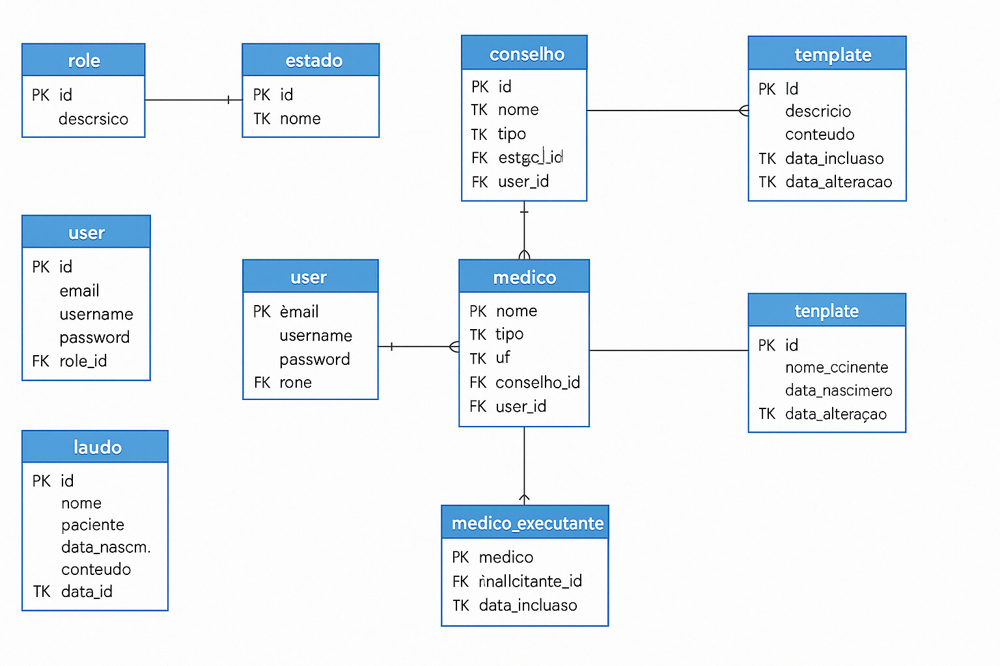

# 🩺 Central de Laudos Médicos

Sistema completo para gerenciamento de laudos médicos, voltado para clínicas e hospitais que realizam exames de imagem. O sistema permite que médicos executantes e solicitantes gerenciem laudos e templates reutilizáveis de forma prática, com controle de acesso baseado em perfis de usuário.

---

## 🔧 Tecnologias Utilizadas

### 💻 Backend
- **Spring Boot 3** (Java 21)
- **PostgreSQL**
- **Autenticação JWT**
- **Protocolo HTTP/2 com GZIP**

### 🌐 Frontend
- **Angular**
- **Controle de rotas por roles**
- **Renderização de templates HTML dinâmicos**

---

## ▶️ Como Executar o Projeto

### Backend

```bash
cd backend/
./mvnw spring-boot:run
```

### Frontend

```bash
cd frontend/
npm install
ng serve
```

---

## 🗄️ Estrutura do Banco de Dados



O sistema possui entidades como `user`, `medico`, `template`, `laudo`, com relacionamentos entre médicos, conselhos, estados e templates vinculados. O relacionamento entre médicos e templates é N:N e os laudos relacionam médico solicitante e médico executante.

---

## 🚀 Funcionalidades

- Autenticação com JWT e controle de acesso por role
- Cadastro e listagem de médicos, usuários e templates
- Cadastro de laudos médicos com conteúdo HTML ou texto
- Templates dinâmicos com placeholders substituíveis (ex: `[NOME DO PACIENTE]`)
- Visualização estilizada de laudos e templates
- Sistema adaptado para médicos EXECUTANTES e SOLICITANTES
- Proteção de rotas e botões com base na role do usuário

---

## 💡 Exemplo de Template HTML

```html
<div>
  <p>Fígado com dimensões preservadas e contornos regulares.</p>
  <p>Presença de esteatose hepática leve.</p>
  <p><strong>Conclusão:</strong> Exame com alterações compatíveis com esteatose leve.</p>
</div>
```

---

## 📫 Contato

Projeto desenvolvido por Gabriela Marim.  
Dúvidas ou sugestões? Fique à vontade para abrir uma issue ou pull request.
